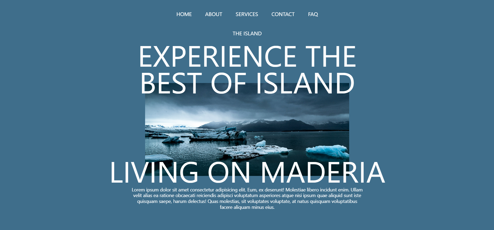
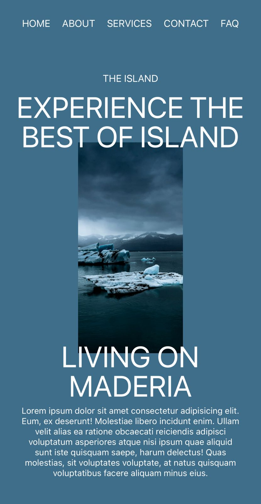

# 🌴 THE ISLAND – Landing Page

A modern and visually engaging tropical-themed landing page built with **React + Vite + TailwindCSS + GSAP**. The page features smooth animations, clean design, and a fully responsive layout optimized for performance and aesthetics.

🔗 **Live Demo:** [Visit THE ISLAND Landing Page](https://the-island-landing-page.netlify.app)

---

## ✨ Features

- 🎞️ Smooth GSAP animations
- 📜 Scroll-triggered effects
- 🎯 Responsive layout (mobile, tablet, desktop)
- ⚡ Built with Vite for fast performance
- 🎨 Styled using Tailwind CSS
- ✅ Clean and reusable React components
- 🌙 Dark tropical theme

---

## 🚀 Tech Stack

| Technology       | Purpose |
|------------------|---------|
| React + Vite     | UI & build tool |
| Tailwind CSS     | Styling framework |
| GSAP             | Animations |
| JSX Components   | UI structure |

---

## 🖼️ Project Preview

Add your screenshots inside a `screenshots/` folder in your project and replace the paths below.

### Desktop View


### Mobile View


---

## 📦 Installation & Setup

Follow these steps to run the project locally:

```bash
# Clone this repository
git clone https://github.com/AKAAravindh/The_Island-Landing_Page.git

# Navigate to the project directory
cd The_Island-Landing_Page

# Install dependencies
npm install

# Start development server
npm run dev
